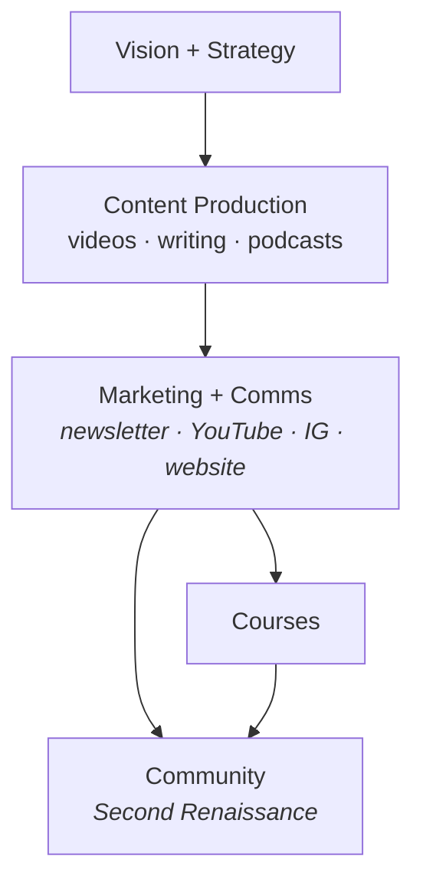

# Production Workflow Overview

## What We're Doing and Why This Diagram Exists

Life Itself is currently focused on **content production and distribution** as its primary activity. Content serves a double purpose: it reaches people interested in social transformation *and* it acts as the top of a funnel leading to deeper engagement — courses, then community (specifically the Second Renaissance movement).

The **ambition** is 5–6 figure audience scale (tens of thousands to hundreds of thousands), but the metric that matters is *reach into the right people*, not raw follower counts. Brand and presence online is the vehicle, not the goal.

## The Core Workflow

```
Content → Marketing + Comms → Community
Content → Courses → Community
```

Content production is the engine. Marketing and comms distribute it and build presence. Courses offer a deeper path for those who want it. Community — particularly the Second Renaissance community and movement — is where people land when they want to go further.

## Why This Diagram

The diagram's job is threefold:

1. **Clarity** — show how the pieces of the operation fit together (content → comms → courses → community)
2. **Sequencing** — where are we in building this, what needs to come next
3. **Operational visibility** — spot bottlenecks, identify feedback loops (e.g. community engagement signals feeding back to content decisions)

The metaphor is a **production line** *or* a **garden** — things feed each other, sequencing matters, and you want to see the whole system at once to manage it well.

## Diagram (v1)



## Next Steps

- Iterate on diagram structure
- Annotate with current status / bottlenecks
- Use as basis for team alignment and onboarding
