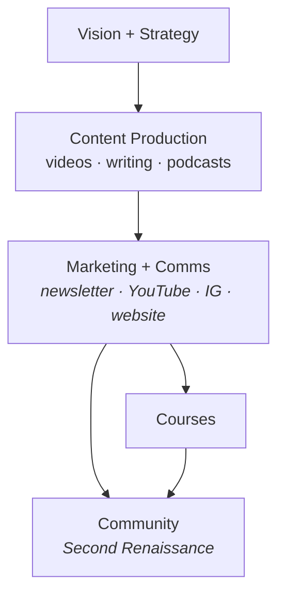
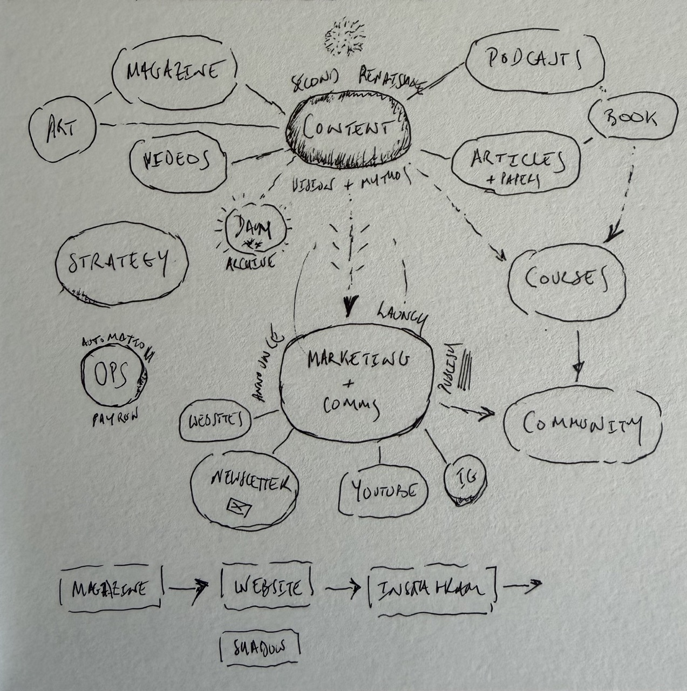

> [!warning]
> This doc is still under construction 🚧 In particular, OKRs need adjusting and improving.

## Introduction / Motivation / Context

The focus in 2026 is **content production and distribution**. The goal is to build a significant following — tens of thousands to hundreds of thousands of people — who are interested in a radically wiser world and a second renaissance. Raw audience size is not the aim; reach into the *right* people is.

### Why content as the priority now?

We want to develop a movement and pockets. That requires a funnel of people going from awareness of the need and possibility of civilizational renewal through to the spiritual warriors who will pioneer change.

Right now, we focus at top of funnel for two reasons:
- You need to start there to have enough people further down
- We now have a good base in terms of content and vision.

In addition, the cultural and civilisational change of the kind Life Itself is working toward requires broad narrative shift, and narrative shift requires presence, voice, and repeated exposure at scale.

Overall Content is the highest-leverage activity available given the team and resources we have.

> [!todo]
> pull material from comms/strategy and also from funnel diagram in 2025 plan excalidraw. Also the recording with Matthew and Armelle.

### Primary brand: Second Renaissance

The **primary brand** for this work is **Second Renaissance**. Life Itself is the collective and organisational home behind it.

### Production workflow

We're producing and sharing content -- and building an aligned community (nb: not yet Sangha). The workflow is roughly as follows:

Content production is the engine. Marketing and comms distribute it and build presence. Courses offer a deeper path for those who want it. Community — the Second Renaissance movement — is where people land when they want to go further. Courses and community are not paused in 2026 but are not the primary focus; content and comms are.

See also the more detailed production plan diagram:

---

## Overall OKRs

**Objective:** Establish Second Renaissance as a recognised, growing voice for civilisational renewal — with consistent content output, measurable audience growth, and a clear brand.

| Key Result                                                        | Target                                                  |
| ----------------------------------------------------------------- | ------------------------------------------------------- |
| Audience reach (combined: YT + IG + podcast)                      | 20,000+                                                 |
| Newsletter subscribers                                            | 5,000+                                                  |
| Content pieces published (long-form: essays, podcast eps, videos) | 24+ (≈2/month)                                          |
| Brand clarity                                                     | Tone of voice doc + visual identity finalised by end Q2 |
| Community members (Second Renaissance)                            | 500+                                                    |

---

## By Area

### Vision and Strategy

**Context:** Before producing content at scale we need clarity on what we are saying and why — the mythos, the narrative frame, the theory of change. This isn't a one-time activity; it feeds back into content decisions continuously. The rigorous version lives in papers and longer-form writing; the accessible version lives in the podcast, magazine, and social content.

**This year's job:** Get the core narrative clear enough to brief collaborators, write to, and iterate on. It does not need to be perfect. "Good enough to ship" is the standard; refinement follows from audience feedback.

**OKRs**

| Key Result | Target |
|---|---|
| Core narrative / brand brief published (internal doc) | Q2 2026 |
| Tone of voice + visual identity guide | Q2 2026 |
| Theory of change written up accessibly (≤1,500 words) | Q3 2026 |

---

### Content Production

**Context:** Content has several layers, from the most rigorous to the most accessible:

1. **Mythos / theory** — rigorous essays and papers; the intellectual foundation
2. **Magazine and long reads** — accessible written pieces for a thoughtful general audience
3. **Podcast** — the core regular output; conversation-led, episodic
4. **Videos** — companion to podcast or standalone; YouTube-first
5. **Curatorial / organisational content** — indexes, reading lists, guides that surface and organise prior material
6. **Social clips and excerpts** — short-form, drawn from long-form

**Polish and cadence:** The working instinct is to favour **higher-production-value long-form pieces** (podcast episodes, essays, videos) released on a regular but not frantic cadence — roughly 2× per month — with a proper launch and announce each time. This cuts through a crowded media landscape better than constant lo-fi posting. Social content is drawn from these anchor pieces rather than produced independently. This is a hypothesis; we iterate based on what gets traction.

**OKRs**

| Key Result                                  | Target             |
| ------------------------------------------- | ------------------ |
| Podcast episodes published                  | 20+ by Dec 2026    |
| Long-form essays / written pieces published | 12+ by Dec 2026    |
| Videos published (YouTube)                  | 12+ by Dec 2026    |
| Social posts per week (across channels)     | 3–5/week sustained |
| Courses launched (polished)                 | 3+ by Dec 2026     |
| Content plan (Jun–Dec) drafted              | End of May 2026    |
### Marketing and Comms

**Context:** Content only works if it reaches people. The comms function has two jobs: (1) distribute each piece of content with a proper launch — newsletter, social, outreach — and (2) build the ongoing presence so that the channels grow and compound over time.

Channels in priority order: newsletter, YouTube, Instagram/TikTok (short-form), podcast platforms.

**OKRs**

| Key Result                                                | Target                    |
| --------------------------------------------------------- | ------------------------- |
| Newsletter sent on consistent cadence with good open rate | Monthly minimum with ≥35% |
| Newsletter open rate                                      |                           |
| YouTube subscribers                                       | 5,000+                    |
| Instagram followers (Second Renaissance)                  | 10,000+                   |
| ❓ Outreach / co-publishing partnerships established       | 3+                        |

---

### Community / Movement

**Context:** The Second Renaissance community is the destination for people who want to go deeper — beyond consuming content into belonging to something and acting. In 2026 this is not the primary focus, but it is not paused. We want it to be a functioning, coherent space that grows organically from the content funnel.

**OKRs**

> [!todo]
> This needs amending ... e.g. how do we measure community members ??

| Key Result                    | Target                  |
| ----------------------------- | ----------------------- |
| Community members (active)    | 500+ by Dec 2026        |
| Community events / gatherings | 4+ (quarterly rhythm)   |
| Course participants           | 200+ across all courses |

---

## Other Areas

### Hubs

Physical hubs are not a 2026 priority. Maintain existing relationships and capacity; no new hub development this year unless an exceptional opportunity arises.

---

## Timeline

*High-level only — detailed content calendar to be developed separately.*

| Period | Focus |
|---|---|
| May–Jun 2026 | Brand brief + tone of voice; content plan Jun–Dec; first podcast eps. Launch rebrand. |
| Jul–Sep 2026 | Content production rhythm established; newsletter growing |
| Oct–Dec 2026 | Review OKRs; push for year-end audience targets; plan 2027 |
